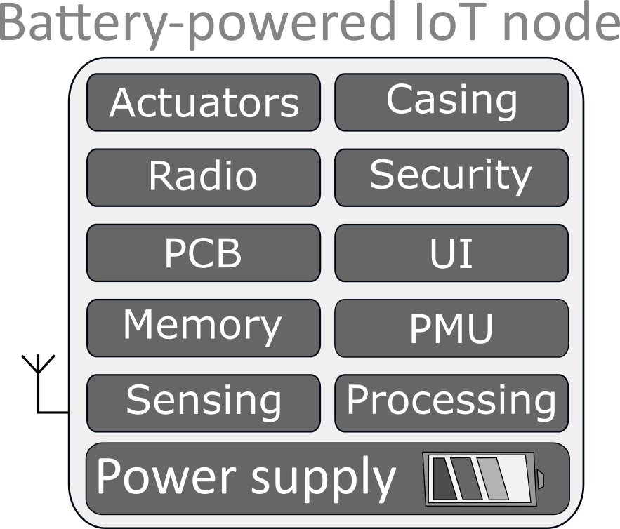

# IoT Node impacts modeling

/!\  The model provided here is still under progress to make it usable for interested people. Do not hesitate to contact me for any questions : 
pol.maistriaux@uclouvain.be

This open-source project provides a modeling of the deployment and maintenace of an IoT node regarding its power consumption, its battery service lifetime, and its environmental footprint. 

The model proposed here is developed in Python

## Working principle of the model

The model is based on:

-   The hardware profile of the IoT node describing the differents components included in the node, e.g., microcontrollers, sensors, radios, and so on. Two a priori information are needed to use the model
    -   Electrical characteristics of the different modules embedded in the different states in which they are used, e.g., active current consumption of microcontroller and operating voltage.
    -   Impacts (e.g., carbon footprint or financial cost) of the different modules/part of the IoT node. Environmental footprint can determined using a bill-of-material and life-cycle assesment (LCA) databases such as GaBi or EcoInvent.

-   The use phase scenario including all information required about the use phase
    -   The tasks performed by the node, e.g., sensing, packet sensing, processing, and the rates at which they are performed. Moreover data or sub-modeling required the task duration are required, e.g., for the LoRa communication example included in this project, model of time-on-air (ToA) has been included.
    -   The replacement strategy, i.e., which parts of the nodes replaced when the battery service lifetime of the node is reached. It can be either only the battery or the complete node.
    -   The transport scheme of deployment and maintenance operation. This refers to how the operator performs the maintenance, for example which vehicle is used, on much distance is traveled, and how much devices are carried at the same time.

The model then works by first evaluating the battery service lifetime based on the power consumption estimation. Based on the impacts of the different modules, the overall impacts (cost, footprint) of the application is then evaluated, including the transport scheme and the replacement strategy.

This project was developed in UCLouvain in the context of ongoing work on environmental footprint of wireless sensor networks (WSN) in the context of environmental monitoring applications. It was the subject of an article presented at the 12th International conference on the Internet-of-Things entitled ["Modeling the Carbon Footprint of Battery-Powered IoT Sensor Nodes for Environmental-Monitoring Applications"](https://doi.org/10.1145/3567445.3567448)

## Structure of the project

This repository contains all the modules needed to run the project on a forest monitoring case study, as well as required information to update it for other IoT device.

- `Hardware_modules/`: it will contain the information of hardware parts as well as template to add new components
- `IoT_node_models/`: contains all the model used in this project, for power consumption estimation and service lifetime
- `Tests/`: contains all the tests available tests at the moment that evaluates the default case study
    -`Node_analysis.py`: analyse the power consumption and service lifetime of the default design depending on multiple parameters, some being parameters of the LoRa communication standard
    -`Environmental_footprint.py`: performs parametric analysis of the default node environmental footprint depending on multiple parameters such as battery capacity, self-discharge of battery, task rates and transport distances.

## Running the project 
The project, even tests must at the moment be ran from the main folder, which is this one.

# Python dependencies
To install via pip    

- plotly
- numpy
- scipy
- sys
- os
- inspect

